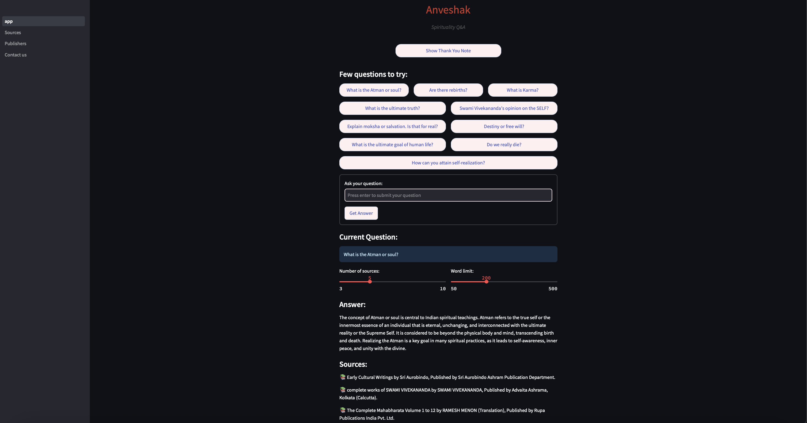

# Anveshak: Spirituality Q&A

[](https://huggingface.co/spaces/ankanghosh/anveshak)
[](https://opensource.org/licenses/Apache-2.0)

A Retrieval-Augmented Generation (RAG) application that provides concise answers to spiritual questions by referencing a curated collection of Indian spiritual texts, philosophical treatises, and teachings from revered Saints, Sages, Siddhas, Yogis, Sadhus, Rishis, Gurus, Mystics, and Spiritual Masters of all genders, backgrounds, traditions, and walks of life.

<p align="center">
  
</p>

## Overview

Anveshak (meaning "seeker" in Sanskrit) serves as a bridge between ancient Indian spiritual wisdom and modern technology, allowing users to ask questions and receive answers grounded in traditional spiritual texts. The system combines the power of modern AI with the timeless wisdom found in these texts, making spiritual knowledge more accessible to seekers.

Our goal is to make a small contribution to the journey of beings toward self-discovery by making this knowledge available and accessible within ethical, moral, and resource-based constraints. **We have no commercial or for-profit interests; this application is purely for educational purposes.**

As stated in the application: "The path and journey to the SELF is designed to be undertaken alone. The all-encompassing knowledge is internal and not external."

### Key Features

- **Question-answering:** Ask spiritual questions and receive concise answers grounded in traditional texts
- **Source citations:** All answers include references to the original texts
- **Configurable retrieval:** Adjust the number of sources and word limit for answers
- **Responsive interface:** Built with Streamlit for a clean, accessible experience
- **Privacy-focused:** No user data or queries are saved
- **Inclusive recognition:** Acknowledges spiritual teachers from all backgrounds, genders, and traditions

## 🧠 How It Works

Anveshak follows a classic RAG architecture:

1. **Data processing pipeline:** Collects, cleans, and processes ~133 spiritual texts
2. **Text embedding:** Uses the E5-large-v2 model to create vector representations of text chunks
3. **Vector storage:** Stores embeddings in a FAISS index for fast similarity search
4. **Retrieval system:** Finds relevant passages from the text collection based on user queries
5. **Generation system:** Synthesizes concise answers from retrieved passages using a large language model

## 🚀 Getting Started

### Prerequisites

- Python 3.8 or higher
- [Google Cloud Storage](https://cloud.google.com/storage) account for data storage
- [OpenAI API](https://openai.com/api/) key for generation

### Installation

1. Clone the repository
   ```bash
   git clone https://github.com/YourUsername/anveshak.git
   cd anveshak
   ```

2. Install dependencies
   ```bash
   pip install -r requirements.txt
   ```

3. Configure authentication
   - Create a `.streamlit/secrets.toml` file with the following structure:
     ```toml
     # GCP Configuration
     BUCKET_NAME_GCS = "your-bucket-name"
     METADATA_PATH_GCS = "metadata/metadata.jsonl"
     EMBEDDINGS_PATH_GCS = "processed/embeddings/all_embeddings.npy"
     INDICES_PATH_GCS = "processed/indices/faiss_index.faiss"
     CHUNKS_PATH_GCS = "processed/chunks/text_chunks.txt"
     EMBEDDING_MODEL = "intfloat/e5-large-v2"
     LLM_MODEL = "gpt-3.5-turbo"
     
     # OpenAI API Configuration
     openai_api_key = "your-openai-api-key"
     
     # GCP Service Account Credentials (JSON format)
     [gcp_credentials]
     type = "service_account"
     project_id = "your-project-id"
     private_key_id = "your-private-key-id"
     private_key = "your-private-key"
     client_email = "your-client-email"
     client_id = "your-client-id"
     auth_uri = "https://accounts.google.com/o/oauth2/auth"
     token_uri = "https://oauth2.googleapis.com/token"
     auth_provider_x509_cert_url = "https://www.googleapis.com/oauth2/v1/certs"
     client_x509_cert_url = "your-client-cert-url"
     ```

### Running the Application Locally

**Important Note**: Running Anveshak locally requires above 16GB of RAM due to the embedding model. Most standard laptops will experience crashes during model loading. Hugging Face Spaces deployment is strongly recommended.

```bash
streamlit run app.py
```

The application will be available at http://localhost:8501.

### Deploying to Hugging Face Spaces

This application is designed for deployment on [Hugging Face Spaces](https://huggingface.co/spaces):

1. Fork this repository to your GitHub account
2. Create a new Space on Hugging Face:
   - Go to [huggingface.co/spaces](https://huggingface.co/spaces)
   - Click "Create new Space"
   - Select "Streamlit" as the SDK
   - Connect your GitHub repository
3. Configure secrets in the Hugging Face UI:
   - Go to your Space settings
   - Under "Repository secrets"
   - Add each of the required secrets from your `.streamlit/secrets.toml` file

## 📚 Project Structure

```
anveshak/
├── .gitignore                # Specifies intentionally untracked files to ignore
├── .gitattributes            # Defines attributes for pathnames in the repository
├── app.py                    # Main Streamlit application
├── requirements.txt          # Python dependencies
├── rag_engine.py             # Core RAG functionality
├── utils.py                  # Utility functions for authentication
├── pages/                    # Streamlit pages
│   ├── 1_Sources.py          # Sources information page
│   ├── 2_Publishers.py       # Publisher acknowledgments page
│   └── 3_Contact_us.py       # Contact information page
├── docs/                     # Documentation
│   └── assets/               # Images and other media
│       └── app_screenshot.png # Application screenshot
│   ├── architecture-doc.md   # Architecture details
│   ├── data-handling-doc.md  # Data handling explanation
│   ├── configuration-doc.md  # Configuration guide
│   ├── changelog-doc.md      # Project change log
│   ├── README.md             # Project overview and instructions
└── scripts/                  # Data processing scripts
    └── preprocessing.ipynb   # Text preprocessing notebook
```

## 🔒 Data Privacy & Ethics

- Anveshak: Spirituality Q&A **does not** save any user data or queries
- All texts are sourced from freely available resources with proper attribution
- Publisher acknowledgments are included within the application
- Word limits are implemented to prevent excessive content reproduction and respect copyright
- User queries are processed using OpenAI's services but not stored by Anveshak
- The application presents information with appropriate reverence for spiritual traditions
- Responses are generated by AI based on the retrieved texts and may not perfectly represent the original teachings, intended meaning, or context
- The inclusion of any spiritual teacher, text, or tradition does not imply their endorsement of Anveshak

## 🔄 Data Flow

```
┌───────────────────┐     ┌───────────────────┐     ┌───────────────────┐
│                   │     │                   │     │                   │
│   Data Pipeline   │────▶│ Retrieval System  │────▶│ Generation System │
│                   │     │                   │     │                   │
└───────────────────┘     └───────────────────┘     └───────────────────┘
        ▲                         ▲                         │
        │                         │                         │
┌───────────────┐        ┌───────────────┐        ┌────────▼───────┐
│               │        │               │        │                │
│ Spiritual     │        │ User Query    │        │ Final Answer   │
│ Text Corpus   │        │               │        │ with Citations │
│               │        │               │        │                │
└───────────────┘        └───────────────┘        └────────────────┘
```

## 📝 Notes

- Anveshak: Spirituality Q&A is designed to provide concise answers rather than lengthy explanations or lists
- The application is not a general chatbot or conversational AI. It is specifically designed to answer spiritual questions with short, concise answers based on referenced texts.
- You may receive slightly different answers when asking the same question multiple times. This variation is intentional and reflects the nuanced nature of spiritual teachings across different traditions.
- Currently, Anveshak is only available in English
- The application acknowledges and honors spiritual teachers from all backgrounds, genders, traditions, and walks of life
- **Anveshak is a tool that is not a substitute for direct spiritual guidance, personal practice, or studying original texts in their complete form.**

## 🙏 Acknowledgments

Anveshak: Spirituality Q&A is made possible by the wisdom contained in numerous spiritual texts and the teachings of revered Saints, Sages, and Spiritual Masters from India and beyond. We extend our sincere gratitude to:

- **The Saints, Sages, Siddhas, Yogis, Sadhus, Rishis, Gurus, Mystics, and Spiritual Masters** of all genders, backgrounds, traditions, and walks of life whose timeless wisdom illuminates this application
- **The Sacred Texts** that have preserved the eternal truths across millennia
- **The Publishers** who have diligently preserved and disseminated these precious teachings
- **The Authors** who have dedicated their lives to interpreting and explaining complex spiritual concepts

See the "Publishers" and "Sources" pages within the application for complete acknowledgments.

## Future Roadmap

- **Multi-language support** (Sanskrit, Hindi, Bengali, Tamil, and more)
- **Enhanced retrieval** with hybrid retrieval methods
- **Self-hosted open-source LLM integration**
- **User feedback collection** for answer quality
- **Personalized learning paths** based on user interests (implemented with privacy-preserving approaches like client-side storage, session-based preferences, or explicit opt-in)

For a complete roadmap, see the [changelog](changelog-doc.md).

## Blog and Additional Resources
Read our detailed blog post about the project: [Anveshak: Spirituality Q&A - Bridging Faith and Intelligence](https://researchguy.in/anveshak-spirituality-qa-bridging-faith-and-intelligence/)

## 📜 License

This project is licensed under the Apache License 2.0 - see the [LICENSE](../LICENSE) file for details.

## 📞 Contact

For questions, feedback, or suggestions, please contact us at ankanatwork@gmail.com.